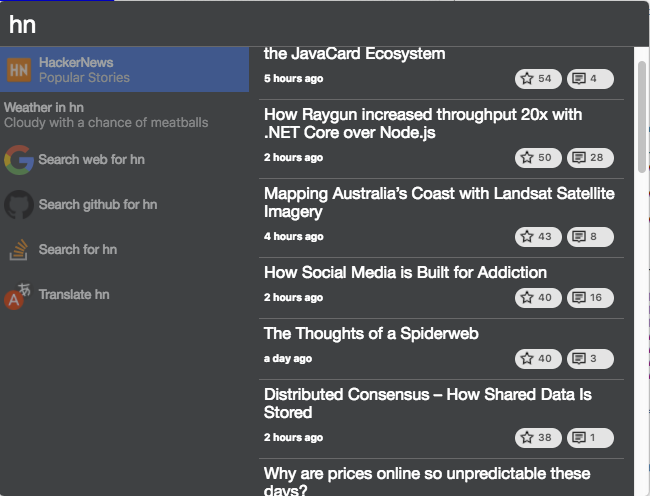

# cerebro-hackernews

> A [HackerNews](https://news.ycombinator.com) plugin for [Cerebro app](http://www.cerebroapp.com)

## Usage
In Cerebro, type `hn` or `hackernews`, then select "HackerNews" to see the list of popular stories. 

<kbd>Enter</kbd> opens the article in a web browser

## Related

* [Cerebro](http://github.com/KELiON/cerebro) – main repo for Cerebro app;
* [cerebro tools](http://github.com/KELiON/cerebro-tools) – package with tools to simplify package creation;

## License

`cerebro-hackernews` is licensed under the [MIT License](LICENSE).
